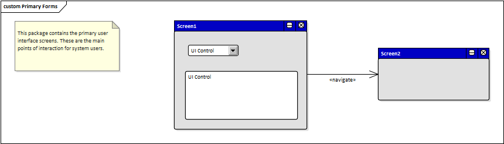
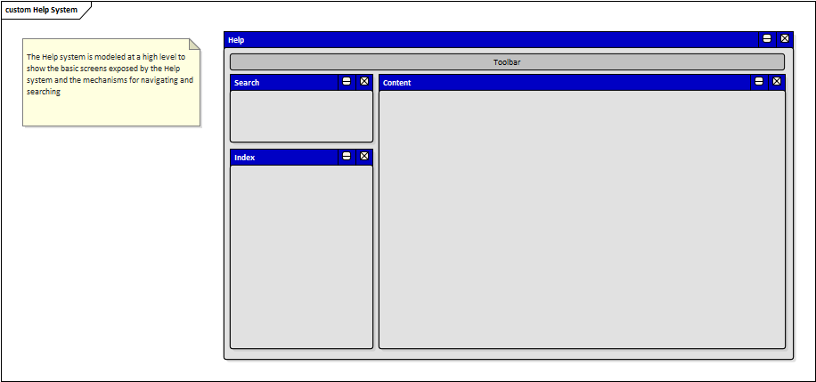

# Documento de Visão do Projeto "Mackenzie Bússola"

Este documento apresenta uma solução de software para o projeto *"Mack Bússola"*, solicitado pelo cliente *"UPM"*, apresentando os problemas a serem solucionados, as necessidades dos principais envolvidos, o alcance do projeto e as funcionalidades 
esperadas do sistema.

## Objetivos

* Oferecer informações gerais e localização sobre as faculdades existentes no campus da Universidade Presbiteriana Mackenzie (Campus Higienópolis).
* Oferecer informações e localização das opções de alimentação dentro do campus (Restaurantes, Cafés, etc).

## Problema

* Devido a sua grande extensão territorial, é comum que pessoas se percam dentro do campus ou não saibam se localizarem dentro dele.  
* Quem é afetado pelo problema: Alunos, Professores, Colaboradores e Terceirizados.
* Impacto no negócio: 
* Benefícios de uma boa solução: A otimização de tempo, clareza de informações, satisfação dos usuários.

## Definições, abreviações e outros termos do domínio do problema

* Definição 1
* Definição 2
* Definição 3
* etc.

## Integração com outros sistemas

* Amazon AWS.
* Google Maps.
 
## Interessados

* Faculdades.
* Comerciantes dentro do campus Mackenzie (Unidade Higienópolis).
* Alunos.
* Professores.
* Colaboradores.
* Terceirizados.

## Usuários

* Alunos.
* Professores.
* Colaboradores.
* Terceirizados.

## Funcionalidades do produto

* Listagem das faculdades dentro do campus Higienópolis.
* Listagem de restaurantes, cafés e opções de alimentação dentro do campus Higienópolis.

## Restrições do projeto

* Campo de busca por palavra-chave inexistente.
* Localização por GPS não habilitado.

## Protótipos de tela

### Protótipos para funcionalidade 1

Fonte: Exemplos gerados pelo assistente do **Enterprise Architect**.

### Protótipos para funcionalidade 2

Fonte: Exemplos gerados pelo assistente do **Enterprise Architect**.

### Protótipos para funcionalidade N

