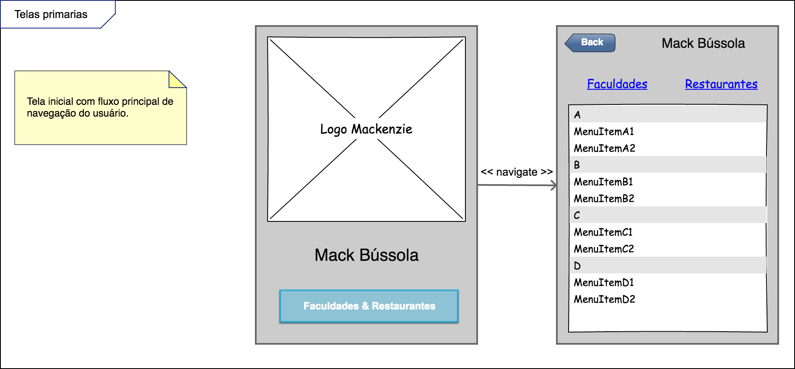
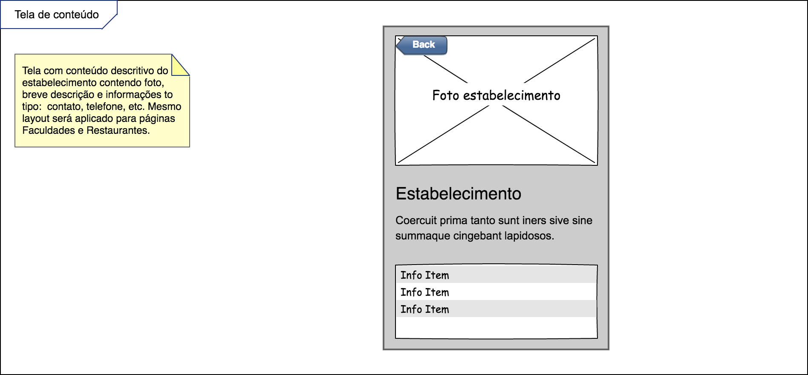

# Documento de Visão do Projeto "Mack Bússola"

Este documento apresenta uma solução de software para o projeto *"Mack Bússola"*, solicitado pelo cliente *"UPM"*, apresentando os problemas a serem solucionados, as necessidades dos principais envolvidos, o alcance do projeto e as funcionalidades 
esperadas do sistema.

## Objetivos

* Oferecer informações gerais e localização sobre as faculdades existentes no campus da Universidade Presbiteriana Mackenzie (Campus Higienópolis).
* Oferecer informações e localização das opções de alimentação dentro do campus (Restaurantes, Cafés, etc).

## Problema

Devido a sua grande extensão territorial, é comum que pessoas se percam dentro do campus Higienópolis, ou tenham uma certa dificuldade em encontrar prédios das faculdades ou restaurantes desejados.

* Quem é afetado pelo problema: Alunos, Professores, Colaboradores e Terceirizados.
* Impacto no negócio: Ajudar os usuários a encontrar os locais que desejam chegar dentro do campus da Universidade Presbiteriana Mackenzie.
* Benefícios de uma boa solução: A otimização de tempo, clareza de informações, satisfação dos usuários.

## Definições, abreviações e outros termos do domínio do problema

* Localização Geográfica
* Informações

## Integração com outros sistemas

* Google Maps.
 
## Interessados

* Faculdades.
* Comerciantes dentro do campus Mackenzie (Unidade Higienópolis).
* Alunos.
* Professores.
* Colaboradores.
* Terceirizados.

## Usuários

* Alunos.
* Professores.
* Colaboradores.
* Terceirizados.

## Funcionalidades do produto

* Listagem das faculdades dentro do campus Higienópolis.
* Listagem de restaurantes, cafés e opções de alimentação dentro do campus Higienópolis.

## Restrições do projeto

* Sistema Operacional: Multiplataforma (Web).
* Hardware: Multiplataforma (Windows/MacOS/Linux).
* Primeiro acesso ao aplicativo irá necessitar de internet.
* Acessos posteriores serão possíveis via cache.

## Protótipos de tela

### Protótipos para funcionalidade 1

### Protótipos para funcionalidade 2

Telas geradas pela aplicação **Pencil**.
