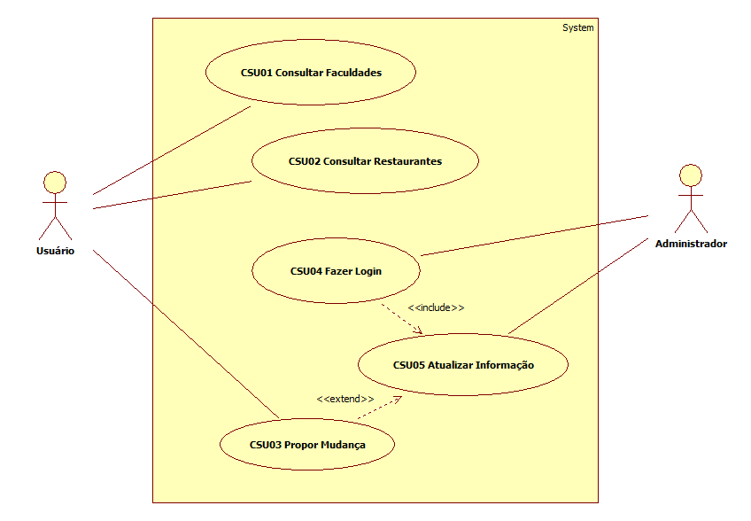

# Casos de uso

## 1. Diagrama de casos de uso

**Instruções do professor**: Insira abaixo o diagrama com os casos de uso do seu sistema. A imagem abaixo é somente um exemplo.

## 2. Especificação dos casos de uso

**Instruções do professor**: Para cada caso de uso, criar as tabelas com a especificação do caso de uso. Siga o exemplo dado abaixo:

### 2.1. Caso de uso **REGISTRAR CHAMADO**

| Campo          | Informação        |
|---|---|
| Identificador: | UC01              |
| Nome:          | Registrar chamado |
| Atores:        | Membro do Help Desk |
| Sumário:       | Registra um novo chamado no sistema |

| Fluxo Principal |
|---|
| 1) O membro do help desk seleciona a opção **Registro de novo chamado** e informa o CPF do cliente. |
| 2) O sistema recupera as informações do cliente pelo CPF.                   |
| 3) O sistema apresenta as informações do cliente e o formulário para o registro do chamado. |
| 4) O membro do help desk informa o tipo de chamado e preenche o campo descrição com o relato do cliente. |
| 5) O sistema registra o chamado e informa que a operação foi bem-sucedida. |

| Fluxo Alternativo (2a): O sistema não encontra as informações do cliente pelo CPF. |
|---|
| 1) O sistema informa que não conseguiu recuperar as informações pelo CPF e apresenta a opção de cadastrar o cliente. |
| 2) O membro do help desk preenche o formulário de cadastro do cliente. |
| 3) O sistema registra os dados do cliente. |
| 4) Volta ao passo (3) do fluxo principal. |

**Instruções do professor**: As tabelas acima mostram um exemplo de especificação de **um único caso de uso**. Lembre-se de especificar cada um dos casos de uso.

