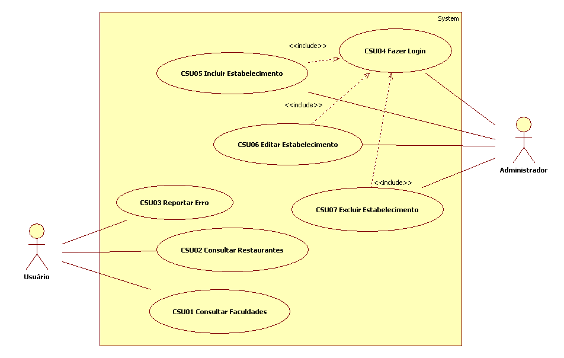

# Casos de uso

## 1. Diagrama de casos de uso

## 2. Especificação dos casos de uso

**Instruções do professor**: Para cada caso de uso, criar as tabelas com a especificação do caso de uso. Siga o exemplo dado abaixo:

### 2.1. Caso de uso **Consultar Faculdades**

| Campo          | Informação        |
|---|---|
| Identificador: | CSU01              |
| Nome:          | Consultar Faculdades. |
| Atores:        | Usuário (Funcionários/Professores/Alunos/Tercerizados). |
| Sumário:       | Consultar informações da faculdade. |

| Fluxo Principal |
|---|
| 1) O Usuário acessa a lista de **Faculdades**. |
| 2) O Usuário localiza a Faculdade desejada.             |
| 3) Aplicação retorna a página com as informações da faculdade. |

### 2.2. Caso de uso **Consultar Restaurantes**

| Campo          | Informação        |
|---|---|
| Identificador: | CSU02              |
| Nome:          | Consultar Restaurantes. |
| Atores:        | Usuário (Funcionários/Professores/Alunos/Tercerizados). |
| Sumário:       | Consultar informações do restaurante. |

| Fluxo Principal |
|---|
| 1) O Usuário acessa a lista de **Restaurantes**. |
| 2) O Usuário localiza o Restaurante desejado.             |
| 3) Aplicação retorna a página com as informações do Restaurante. |

### 2.3. Caso de uso **Reportar Erro**

| Campo          | Informação        |
|---|---|
| Identificador: | CSU03              |
| Nome:          | Reportar Erro. |
| Atores:        | Usuário (Funcionários/Professores/Alunos/Tercerizados). |
| Sumário:       | Propor alguma mudança da página ao Administrador. |

| Fluxo Principal |
|---|
| 1) O Usuário acessa a lista. |
| 2) O Usuário localiza o local desejado.             |
| 3) Aplicação retorna a página com as informações do local. |
| 3) O Usuário clica no campo "Reportar Erro". |
| 4) A aplicação retorna a página com um formulário para preencher. |
| 5) O Usuário informa o erro e clica em "Enviar". |
| 6) A aplicação envia a proposta de mudança para a conta do Administrador. |

| Fluxo Alternativo |
|---|
| 1) O Usuário acessa a lista. |
| 2) O Usuário localiza o local desejado.             |
| 3) Aplicação retorna a página com as informações do local. |
| 3) O Usuário clica no campo "Alterar". |
| 4) A aplicação retorna a página com campos a serem alterados. |
| 5) O Usuário clica em "Cancelar". |
| 6) A Aplicação retorna a página do local. |

### 2.4. Caso de uso **Fazer Login**

| Campo          | Informação        |
|---|---|
| Identificador: | CSU04              |
| Nome:          | Fazer Login. |
| Atores:        | Administrador. |
| Sumário:       | Logar no sistema. |

| Fluxo Principal |
|---|
| 1) O Administrador clica em "Área do Administrador". |
| 2) O Administrador informa o usuário e a senha (informação pré-cadastrada).             |
| 3) Aplicação retorna a página com as opções de "Incluir", "Alterar", "Deletar" e "Reporte de erro". |

| Fluxo Alternativo |
|---|
| 1) O Administrador clica em "Área do Administrador". |
| 2) O Administrador informa o usuário e a senha incorretos.    |
| 3) O Sistema informa uma mensagem de erro. |

### 2.5. Caso de uso **Incluir Estabelecimento**

| Campo          | Informação        |
|---|---|
| Identificador: | CSU05              |
| Nome:          | Incluir Estabelecimento. |
| Atores:        | Administrador. |
| Sumário:       | Incluir estabelecimento na lista. |

| Fluxo Principal |
|---|
| 1) O Administrador clica em "Incluir". |
| 2) O Sistema devolve uma página com opção de "Restaurantes" ou "Faculdades".    |
| 3) O Administrador clica em uma das opção de passo 2. |
| 4) O Sistema devolve uma página com os campos a serem preenchidos. |
| 5) O Administrador preenche os campos com as informações do estabelecimento. |
| 6) O Adminstrador clica em "Incluir". |
| 7) O Sistema inclui o novo estabelecimento na lista e retorna para a página de opções do Administrador. |

| Fluxo Alternativo |
|---|
| 1) O Administrador clica em "Incluir". |
| 2) O Sistema devolve uma página com opção de "Restaurantes" ou "Faculdades".    |
| 3) O Administrador clica em uma das opção de passo 2. |
| 4) O Sistema devolve uma página com os campos a serem preenchidos. |
| 5) O Administrador preenche os campos com as informações do estabelecimento. |
| 6) O Administrador clica em "Cancelar".    |
| 7) O Sistema retorna para a página de opções do Administrador. |

### 2.6. Caso de uso **Editar Estabelecimento**

| Campo          | Informação        |
|---|---|
| Identificador: | CSU06              |
| Nome:          | Editar Estabelecimento. |
| Atores:        | Administrador. |
| Sumário:       | Editar estabelecimento da lista. |

| Fluxo Principal |
|---|
| 1) O Administrador clica em "Editar". |
| 2) O Sistema devolve uma página com opção de "Restaurantes" ou "Faculdades".    |
| 3) O Administrador clica em uma das opção de passo 2. |
| 4) O Sistema devolve uma página com a lista de itens escolhidos. |
| 5) O Administrador clica no estabelecimento que deseja editar. |
| 6) O Sistema devolve uma página com os campos a serem editados. |
| 7) O Administrador edita os campos com as informações do estabelecimento. |
| 8) O Administrador clica em "Alterar". |
| 9) O Sistema atualiza as informações do estabelecimento e retorna para a página de opções do Administrador. |

| Fluxo Alternativo |
|---|
| 1) O Administrador clica em "Editar". |
| 2) O Sistema devolve uma página com opção de "Restaurantes" ou "Faculdades".    |
| 3) O Administrador clica em uma das opção de passo 2. |
| 4) O Sistema devolve uma página com a lista de itens escolhidos. |
| 5) O Administrador clica no estabelecimento que deseja editar. |
| 6) O Sistema devolve uma página com os campos a serem editados. |
| 7) O Administrador edita os campos com as informações do estabelecimento. |
| 8) O Administrador clica em "Cancelar".    |
| 9) O Sistema retorna para a página de opções do Administrador. |

### 2.7. Caso de uso **Excluir Estabelecimento**

| Campo          | Informação        |
|---|---|
| Identificador: | CSU07              |
| Nome:          | Excluir Estabelecimento. |
| Atores:        | Administrador. |
| Sumário:       | Excluir estabelecimento da lista. |

| Fluxo Principal |
|---|
| 1) O Administrador clica em "Deletar". |
| 2) O Sistema devolve uma página com opção de "Restaurantes" ou "Faculdades".    |
| 3) O Administrador clica em uma das opção de passo 2. |
| 4) O Sistema devolve uma página com a lista de itens escolhidos. |
| 5) O Administrador clica no estabelecimento que deseja deletar. |
| 6) O Sistema devolve uma página com as informações do estabelecimento. |
| 7) O Administrador clica em "Deletar". |
| 8) O Sistema deleta o estabelecimento da lista e retorna para a página de opções do Administrador. |

| Fluxo Alternativo |
|---|
| 1) O Administrador clica em "Deletar". |
| 2) O Sistema devolve uma página com opção de "Restaurantes" ou "Faculdades".    |
| 3) O Administrador clica em uma das opção de passo 2. |
| 4) O Sistema devolve uma página com a lista de itens escolhidos. |
| 5) O Administrador clica no estabelecimento que deseja deletar. |
| 6) O Sistema devolve uma página com as informações do estabelecimento. |
| 7) O Administrador clica em "Cancelar".    |
| 8) O Sistema retorna para a página de opções do Administrador. |
